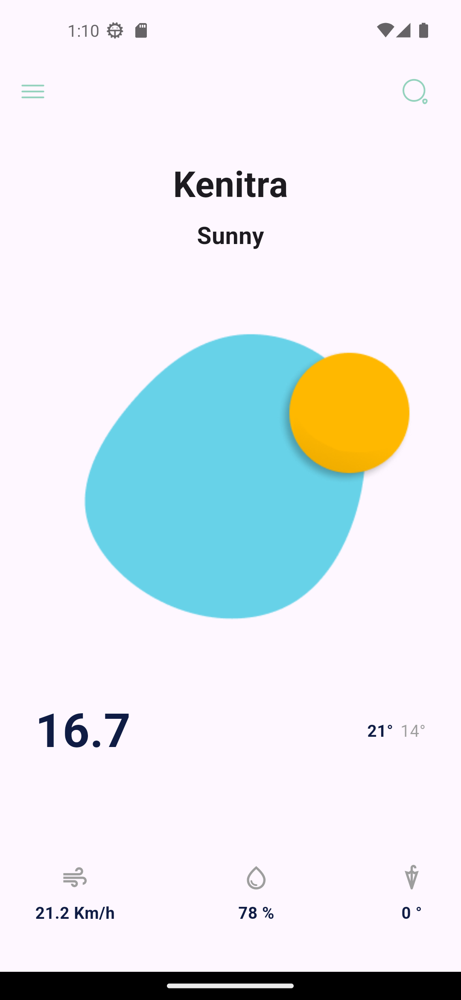
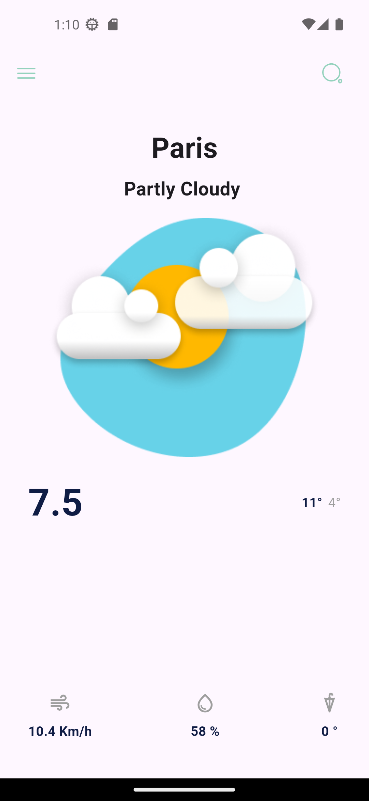
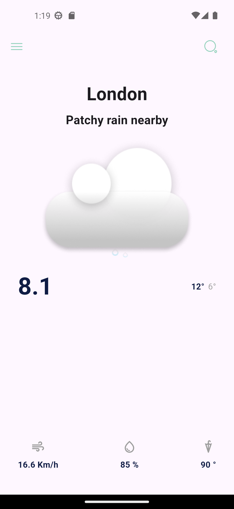

# 🌤️ Weather App (Flutter)

A modern and responsive weather application built with **Flutter** that provides real-time weather data for any city worldwide.

---

## 📱 Overview

This app allows users to search for any city and instantly get accurate weather information including temperature, weather condition, humidity, wind speed, and chance of rain — all displayed in a clean and intuitive UI.

---

## ✨ Features

* 🔍 Search weather by city name
* 🌡️ Real-time temperature updates
* ☁️ Dynamic weather conditions (Sunny, Cloudy, etc.)
* 💧 Humidity percentage
* 🌬️ Wind speed information
* ☔ Chance of rain
* 🎨 Dynamic UI based on weather condition
* 📱 Fully responsive design (works on all screen sizes)
* ⚡ Fast and lightweight

---

## 🧱 Built With

* **Flutter** (UI Framework)
* **Dart**
* **Bloc (Cubit)** for state management
* **REST API** (Weather API integration)
* Clean Architecture principles

---

## 📸 Screenshots

### 🔹 Home Screen


### 🔹 Search Screen


### 🔹 Weather Result (Sunny)



### 🔹 Weather Result (Cloudy)



### 🔹 Weather Result (Rainy)




---

## 🚀 Getting Started

### 1️⃣ Clone the repository

```bash
git clone https://github.com/ABDELMALEKEL-HAFIDY/Weather_app
```

### 2️⃣ Navigate to the project

```bash
cd weather_app
```

### 3️⃣ Install dependencies

```bash
flutter pub get
```

### 4️⃣ Run the app

```bash
flutter run
```

---

## 🔑 API Configuration

This app uses a weather API to fetch data.

1. Get your API key
2. Add it to your service file

Example:

```dart
const apiKey = "YOUR_API_KEY";
```

---

## 📂 Project Structure

```
lib/
│
├── core/
│   ├── models/
│   ├── services/
│   └── utils/
│
├── features/
│   ├── presentation/
│   │   ├── cubits/
│   │   └── screens/
│   └── widgets/
│
└── main.dart
```

---

## 🎯 Future Improvements

* 🌍 Auto-detect user location
* 📅 7-day weather forecast
* 🌙 Dark mode support
* 🌐 Multi-language support
* 🔔 Weather notifications

---

## 👨‍💻 Author

* **Abdelmalek El-hafidy**
* GitHub: https://github.com/ABDELMALEKEL-HAFIDY

---

## 📄 License

This project is open source and available under the MIT License.

---

## ⭐ Support

If you like this project, don’t forget to **star ⭐ the repository**!
